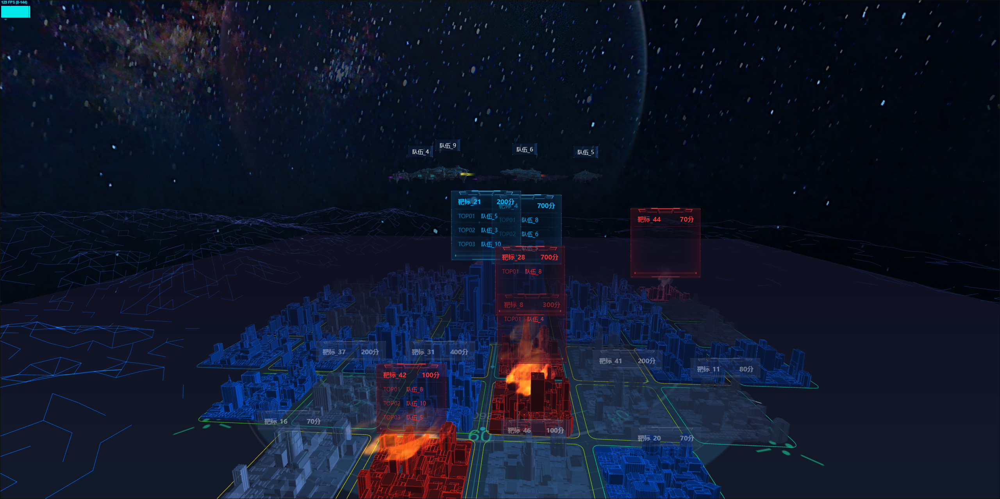

# CTF竞赛结果演示大屏 | CTF Defence 3D Screen


## 一. ctf-awd大屏渲染流程
### 1. 加载模型（飞机模型、城市模型），加载立方体贴图（用于天空盒），加载地面贴图，用于构建地面纹理；加载队伍和靶标数据。
```
const assets = await CTFAssetsLoader.load();
const [targetData, teamData] = await Promise.all([
        axios.get('/json/targets.json'),
        axios.get('/json/teams.json')
    ])
```

### 2. 初始化场景
#### 2.1 初始化场景、相机，包含初始化灯光、特写相机跟全局相机、雷达扫描动画、地形等细节的设置
```
const playgroundCTF = new PlaygroundCTF((document.querySelector('#ctf') as HTMLElement), assets)
```
#### 2.2 初始化队伍和靶标，包含队伍和靶标的位置和形状属性、攻击和被攻击动作属性、队伍和靶标的HTML标签设置，以及爆炸等动态效果设置
```
// 初始化靶标
const targets = targetData.data.map((item:any) => {
    // 靶标 3D 模型，从资源文件的建筑物中随机取一个
    const buildingModel = assets.buildings[random(0, assets.buildings.length - 1)]
    // 靶标模型实例
    return new TargetCTF(buildingModel, item.name, item.score)
})
// 初始化队伍
const teams = teamData.data.map((item:any) => {
    // 队伍 3D 模型
    const teamModel = assets.aerobat
    return new TeamCTF(teamModel as any, item.name)
})
// 向场景添加队伍和靶标
playgroundCTF.setTeams(teams)
playgroundCTF.setTargets(targets)
```

### 3. 随机生成攻击动效
```
// 随机攻击
function randomAttack() {
    if (!teams.length || !targets.length) return
    // 随机选一个队伍
    const team = teams[random(0, teams.length - 1)]
    // 随机选一个靶标
    const target = targets[random(0, targets.length - 1)]
    // 随机表示是否攻击成功
    const isSuccess = Math.random() > 0.5
    // 开始攻击
    team.toAttack(target, isSuccess)
    // 一直进行模拟攻击
    setTimeout(randomAttack, Math.random() * 10000)
}
```

## 二. 项目启动
### 环境配置
* Node: 16~22(`v16.20.2(已验证)`)
* Yarn: (`v1.22.19(已验证)`)
* npm: (`v8.1.3(已验证)`)
### 安装及运行
1. 安装依赖
   ```
   npm install
   ```

2. Compiles and hot-reloads for development
   ```
   npm run serve
   ```

3. Compiles and minifies for production
   ```
   npm run build
   ```

4. Lints and fixes files
   ```
   npm run lint
   ```

### Customize configuration
See [Configuration Reference](https://cli.vuejs.org/config/).
